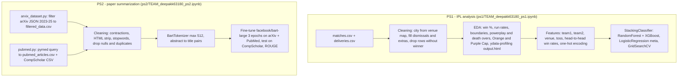

# braindead_1-2

[filtered_data.csv](https://www.kaggle.com/datasets/harshdipsaha/arxiv-data-from-2023-25)


# BrainDead Team Project Repository  

This repository contains implementations for two problem statements as part of the **BrainDead** competition:  

- **PS1:** IPL Data Analysis and 2025 Winner Prediction  
- **PS2:** Research Article Summarization Using Advanced NLP Techniques  

## Table of Contents  
- [Overview](#overview)  
- [Problem Statement 1: IPL Data Analysis](#problem-statement-1-ipl-data-analysis)  
- [Problem Statement 2: Research Article Summarization](#problem-statement-2-research-article-summarization)  
- [Repository Structure](#repository-structure)  
- [Setup Instructions](#setup-instructions)  
- [PS1: IPL Analysis Usage](#ps1-ipl-analysis-usage)  
- [PS2: Paper Summarization Usage](#ps2-paper-summarization-usage)  
- [Contributors](#contributors)  

## Overview  
This repository showcases our solutions to two distinct data science challenges:  

- **Cricket analytics** with predictive modeling for IPL 2025  
- **Scientific paper summarization** using hybrid NLP techniques  

## Problem Statement 1: IPL Data Analysis  
An extensive analysis of IPL data (2008-2024) to uncover insights and predict the 2025 IPL winner. The project includes:  

- Comprehensive data cleaning and preprocessing  
- Exploratory data analysis of team and player performance  
- Feature engineering and extraction  
- Ensemble model development for winner prediction  
- Visualization of key metrics and trends  

## Problem Statement 2: Research Article Summarization  
A hybrid extractive-abstractive model for summarizing scientific research papers. Key features include:  

- Processing of multiple research article datasets (**CompScholar, ArXiv, PubMed**)  
- Token length reduction (**95%+ reduction across datasets**)  
- Vocabulary optimization (**10-16% reduction in size, 50%+ improvement in OOV rates**)  
- Data quality enhancement (**elimination of null values and duplicates**)  
- LED-based architecture for long document summarization  

## Setup Instructions  

### Prerequisites  
- Python **3.7+**  
- Git  

### Installation  

### Clone the repository:  
```bash
git clone https://github.com/HARSHDIPSAHA/braindead_1-2.git
cd braindead_1-2
```

### Create and activate a virtual environment:

```bash
python -m venv venv
source venv/bin/activate  # On Windows: venv\Scripts\activate
```
### Install dependencies for both projects:

```bash
# For PS1: IPL Analysis
pip install pandas numpy matplotlib seaborn scikit-learn xgboost tensorflow

# For PS2: Paper Summarization
pip install torch transformers pandas numpy scikit-learn rouge-score nltk

# For PS2: Download NLTK resources
python -c "import nltk; nltk.download('punkt'); nltk.download('stopwords')"

```
PS1: IPL Analysis Usage
Navigate to the PS1 directory:

bash
```
cd ps1
Download the IPL dataset:
```
bash
```
# Download from the provided link in the problem statement
# Place the matches.csv and deliveries.csv files in the data/ directory
Run the analysis notebook:
```
bash
```
jupyter notebook notebooks/ipl_analysis.ipynb
```
For prediction model:
bash
```
jupyter notebook notebooks/ipl_prediction.ipynb
```

PS2: Paper Summarization Usage


Navigate to the PS2 directory:

bash
```
cd ps2
```

## How it works



## Repository Structure

```
ps1/
  TEAM_deepakk63180_ps1.ipynb   IPL cleaning, EDA and winner-prediction model
  matches.csv, deliveries.csv   IPL 2008-2024 data
  output.html                   ydata-profiling report of matches.csv
ps2/
  TEAM_deepakk63180_ps2.ipynb   dataset cleaning, length analysis, BART fine-tuning and ROUGE evaluation
  arvix_dataset.py              builds filtered_data.csv from the arXiv metadata JSON (Kaggle link at the top of this README)
  pubmed.py                     downloads PubMed abstracts for five topics via pymed
  pubmed_articles.csv           output of pubmed.py
  Brain Dead CompScholar Dataset.csv
  1909.03186v2.pdf              reference paper
```

## Results (from saved notebook outputs)

- PS1 stacking model (RF + XGBoost, LogisticRegression meta): test accuracy 0.595 with default estimators, 0.620 after GridSearchCV tuning (`ps1` notebook, cells near the end).
- PS2: the ROUGE evaluation cell is present but its output is not saved in the committed notebook.

## Status and limitations

- Both problem statements live in single notebooks; there is no `notebooks/ipl_analysis.ipynb` or `notebooks/ipl_prediction.ipynb` as named above - open the `TEAM_deepakk63180_*.ipynb` files instead.
- The committed PS2 notebook fine-tunes `facebook/bart-large`; the LED variant mentioned above is not in the committed code.
- Some paths are hard-coded to the author's machine (`H:\braindead\...`, `H:\research paper\...`); edit them before running.
esearch paper\...`); edit them before running.
esearch paper\...`); edit them before running.
- The pipeline for PS1 predicts per-match winners from pre-match features; there is no saved 2025 season simulation output in the notebook.
